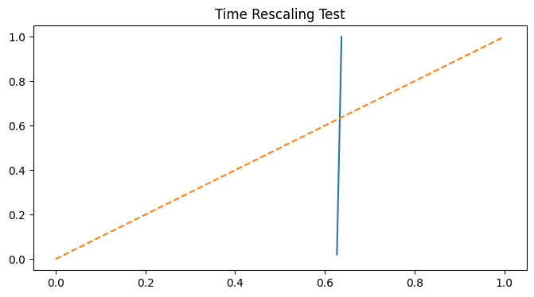

<h1 align="center">
Inference and Model Assessment of Hawkes Processes for Cyber Event Data
</h1>

<b>Zixuan Xu</b> 
Mixture Hawkes Project

---

## 📊 Project Overview

This project presents a full statistical pipeline for modeling cyber attack event data using Hawkes processes, including inference, model validation, and interpretation.

---

## 🎯 Research Objective

To investigate whether cyber attack events exhibit self-exciting behavior and evaluate the adequacy of Hawkes processes in capturing temporal dependence.

---

## 📌 Motivation

Cyber attack events are often modeled as independent Poisson processes.

However, real-world data frequently exhibit clustering and temporal dependence, motivating the use of self-exciting point process models.

---

## ⚙️ Methodology

- Hawkes process modeling of event arrivals  
- EM-based maximum likelihood estimation  
- Model selection using Bayesian Information Criterion (BIC)  
- Bootstrap-based uncertainty quantification  
- Time-rescaling test for goodness-of-fit validation  

---

## 📈 Key Results

- Evidence of temporal dependence and clustering  
- Weak but persistent self-excitation  
- Clear deviation from Poisson assumptions  
- Model misspecification detected via time-rescaling  

---

## 🧠 Interpretation

The analysis shows that cyber attacks are not purely random but exhibit mild clustering behavior.

Compared to a homogeneous Poisson process, the Hawkes model captures temporal dependence and provides a more realistic representation of cyber attack dynamics.

However, the time-rescaling test reveals systematic deviations, indicating that the model does not fully capture the underlying structure.

---

## 🖼️ Model Validation (Time-Rescaling Test)

The figure shows the empirical distribution of transformed event times compared to the theoretical uniform distribution.

A correctly specified model should align closely with the diagonal line.

In this case, the deviation from the diagonal indicates that the Hawkes model does not fully capture the underlying event dynamics, suggesting model misspecification.

---

## 🧩 Key Contributions

- Demonstrated deviation from Poisson assumptions  
- Quantified self-excitation effects  
- Applied statistical validation via time-rescaling  
- Identified limitations of standard Hawkes models  

---

## 📁 Repository Structure

    Mixture-Hawkes-Project/
    │
    ├── data/                 # (not included due to size)
    ├── notebooks/            # development notebooks
    │   ├── 01_Hawkes_Analysis.ipynb
    │   ├── 02_Cybersecurity_Application.ipynb
    │
    ├── final/                # polished research output
    │   ├── hawkes_cyber_analysis.ipynb
    │   ├── hawkes_cyber_analysis.pdf
    │   ├── time_rescaling.png
    │
    ├── README.md

---

## 📦 Data

The dataset is not included due to size constraints.

The code automatically falls back to synthetic data for demonstration.

To use real data, place your CSV file in a `data/` folder.

---

## 🚀 Future Work

- Multivariate Hawkes processes  
- Bayesian inference (full uncertainty modeling)  
- Nonparametric kernel estimation  

---

## 🧾 Summary

A full pipeline for modeling and validating cyber event dynamics using Hawkes processes, combining inference, statistical testing, and model critique.

---

## 👤 Author

Zixuan Xu
  
